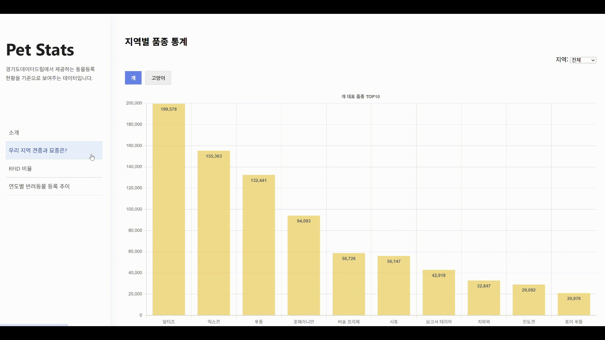
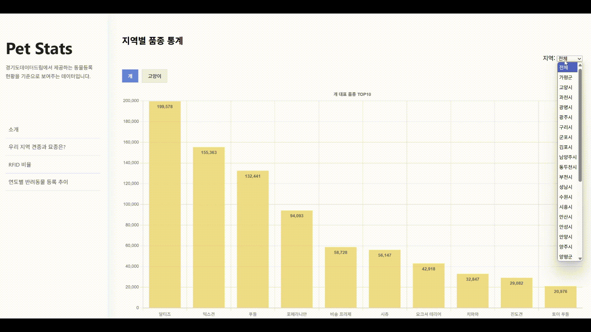
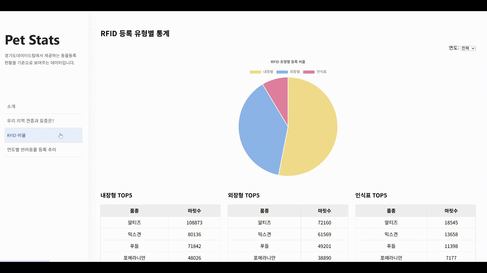
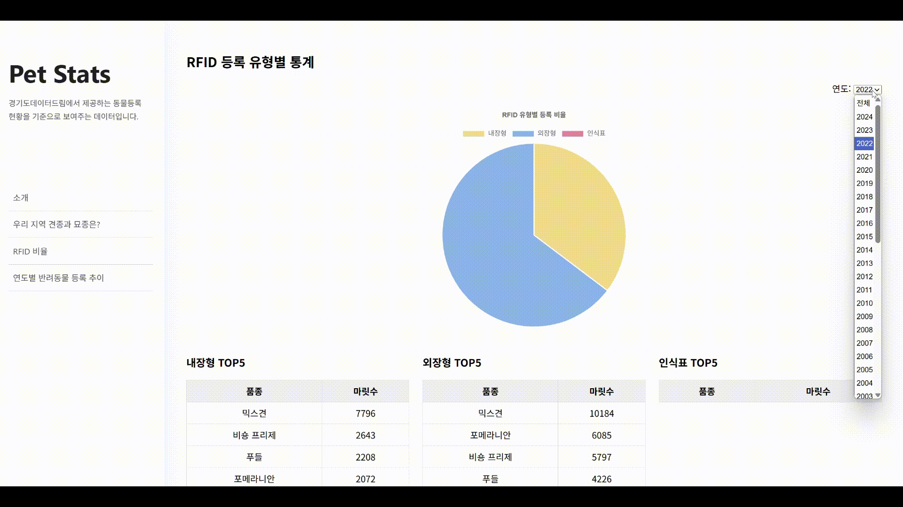
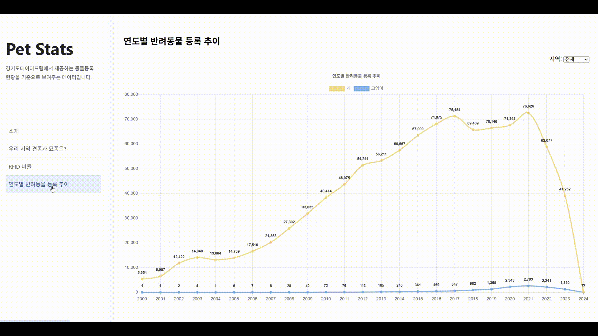
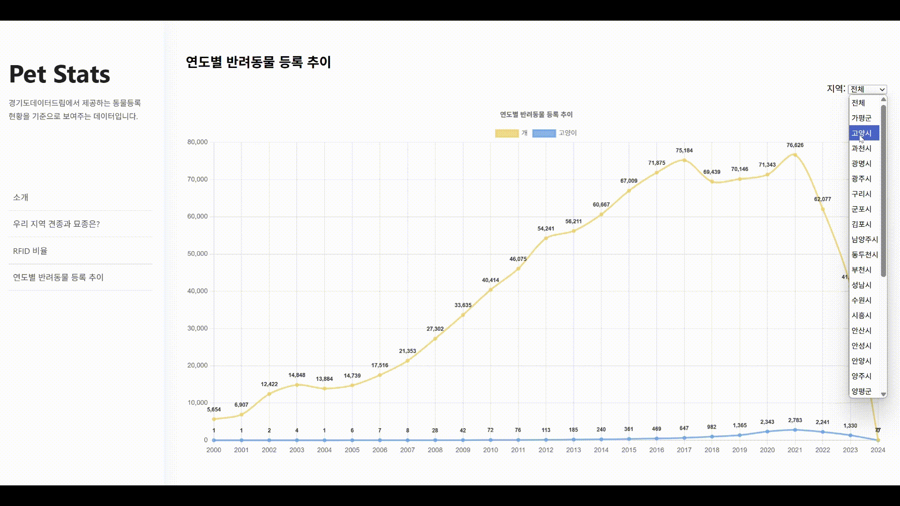

# 🐾 Pet Stats

**반려동물 등록 통계를 시각화하여 한눈에 볼 수 있는 서비스입니다.**  
경기도 반려동물 등록 데이터를 기반으로,  
지역별/연도별/등록유형별로 다양한 통계를 확인할 수 있습니다.

---

## 📸 주요 화면

### 📍 지역별 대표 품종 TOP10



### 📍 RFID 등록 유형별 통계



### 📍 연도별 등록 추이



---

## 🛠️ 사용 기술 스택

- **Backend**: Spring Boot, QueryDSL, Spring Cache
- **Frontend**: Mustache, Chart.js
- **Database**: MariaDB(Docker)

---

## ✨ 주요 기능

- 지역별 대표 품종(개/고양이) TOP10 조회
- RFID 등록 유형별 비율 분석
- 연도별 등록 추이 분석
- 지역/연도별 필터링 기능 지원
- 반응형 차트 (Chart.js)

---

## 📂 프로젝트 구조

```plaintext
petstats/
├── java/
│   ├── config/                       # 설정 관련 클래스 (QueryDSL 설정 등)
│   ├── domain/                       # 도메인(엔티티/리포지토리/쿼리리포지토리)
│   ├── service/                      # 서비스 레이어
│   │   └── cache/
│   └── web/                          # 웹 요청 처리 (Controller, DTO)
├── resources/
│   ├── static/                           # 정적파일
│   └── templates/                        # Mustache 템플릿
└── generated/                            # QueryDSL Q클래스 자동 생성 디렉토리
```